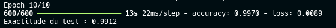
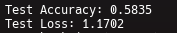
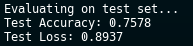
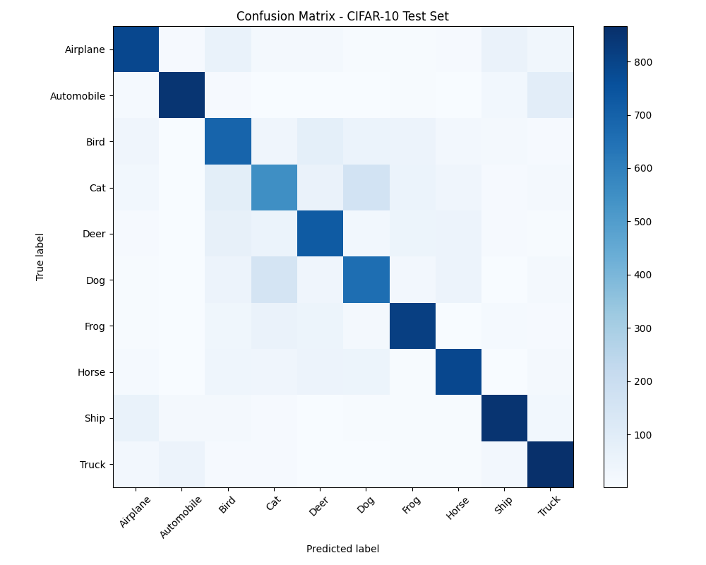
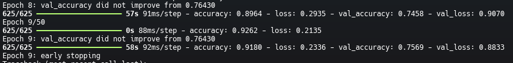
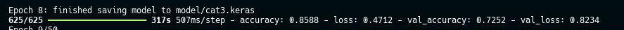
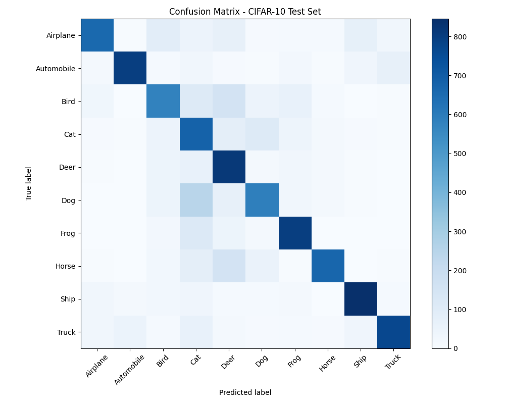
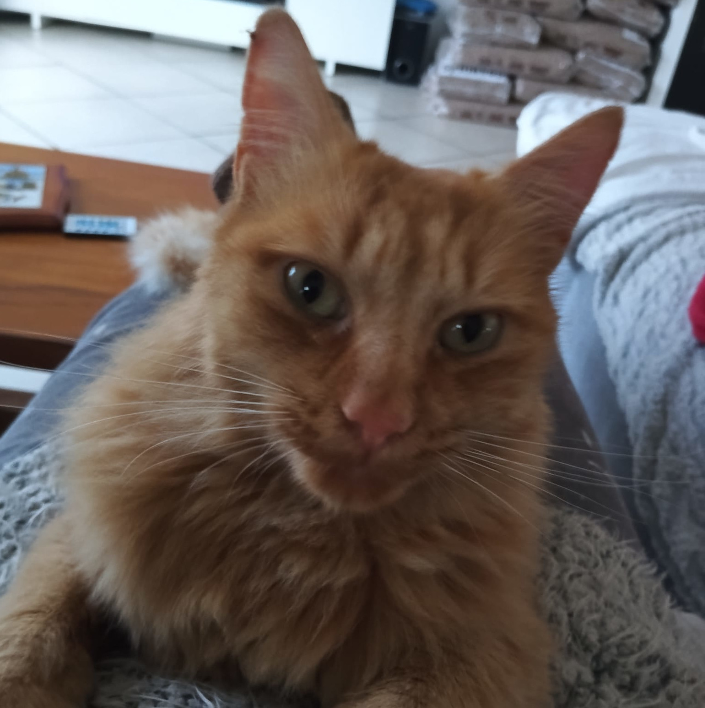
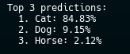
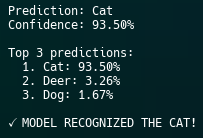

# Image recognition with MLP and CNN

The goal is to understand how image recognition works with deep learning.  
This README is a brief introduction to a complex topic — there is much to say about perceptrons, activation functions, optimization, CNNs, etc., that we cannot fully cover here.

To give ourselves a concrete final goal, we want to show that my computer can recognize that my cat is a cat.

### Our Approach

We start from the fundamentals and progressively increase complexity:

1. **Binary Classifier** (0 vs non-0) — Understanding the basics with a single neuron  
2. **Multi-class Classifier** (digits 0–9) — Adding complexity with multiple perceptrons  
3. **Multi-Layer Perceptron (MLP)** — Understanding why depth helps and overfitting  
4. **Convolutional Neural Networks (CNN)** — Learning spatial features for image recognition  
5. **Real-world Application** — Testing on a photo of my cat  

Each step teaches us something new about how neural networks learn from data.

---

## Binary classifier and basics of Deep Learning

### Perceptrons

To start, let’s use the MNIST dataset.  
Our objective here is to differentiate the digit **0** from all other digits.

In principle, we only need a single perceptron.


To explain what is happening inside this perceptron, we divide the explanation into several parts:

1. At the beginning, we have an image made of pixels. These are our inputs.  
   Since MNIST images are 28×28 pixels, we have 784 inputs, which form a vector of size 784.

2. The weights form a vector with the same dimension as the input (784).  
   They are used to determine whether our image represents a zero or not, together with the bias, using the following function:

   $$
   f(x) =
   \begin{cases}
   1 & \text{if } b + w \cdot x > 0 \\
   0 & \text{otherwise}
   \end{cases}
   $$

   where:
   - $w$ is the weight vector  
   - $x$ is the input example  
   - $b$ is the bias  

3. Finally, we have an activation function.  
   The goal of this function is to “de-linearize” the output, which we will see later, and to normalize the output between 0 and 1 in the case of the sigmoid function. The function then becomes:

   $$
   f(x) = \phi(b + w \cdot x)
   $$

   In this case, it is not strictly necessary, but it is a general and very important concept for the following parts.

You can now understand this line in the binary classifier:

> keras.layers.Dense(1, activation='sigmoid', input_shape=(784,))


This corresponds to one layer with one perceptron, 784 inputs, and a sigmoid activation function.

---

### Perceptron’s Algorithm

Invented in 1957 by F. Rosenblatt, the goal of the perceptron algorithm is to train the perceptron to find the best weights for our problem.

1. Initialize weights and bias to 0  
2. For N iterations or until convergence:
   - For each example $(x, a)$:
     - If $a - f(x) = 0$: continue  
     - Else, for each weight $w_i$:
       $$
       \Delta w_i = (a - f(x)) \cdot x_i
       $$
       $$
       w_i := w_i + \Delta w_i
       $$
   - If there are no errors: converged, stop  

Where:
- $a$ is the true label  
- $f(x)$ is the prediction  

---

### Results and Criticism

We obtained a success rate of **99.19%**.  
However, since only 10% of the images in the test set are zeros, we can identify a form of bias in this result.

The model may be very good at recognizing non-zero digits, but it may be harder for it to recognize zeros.


If we test specifically on zeros using `binary_classifier_critik.py`, we obtain **96% accuracy**.  
This is still good, but we can do better. Let’s continue.


---

## Multiple perceptrons and backpropagation

### The Main Idea

Previously, we used one perceptron to solve a binary problem: *Is it a 0 or not?*

Now, we want to classify all 10 digits (0–9). Following the same logic:
- One perceptron corresponds to one class  
- We need 10 perceptrons, one for each digit  
- Each perceptron outputs a probability: “How likely is this image to be digit X?”

Architecture:
- Input: 784 pixels (flattened 28×28 image)  
- Output: vector of size 10 (one probability per digit, one-hot encoded label)  
- Decision: the digit with the highest probability wins  

For example, if the output is `[0.01, 0.98, 0.05, ...]`, the model predicts digit **1**.


---

### How to Train This Model (1): Softmax and Cross-Entropy

**Softmax** converts raw scores into probabilities:

$$
\text{softmax}(z_i) = \frac{e^{z_i}}{\sum_{j=1}^{10} e^{z_j}}
$$

This ensures that all outputs sum to 1 and lie between 0 and 1.

**Cross-entropy loss** measures how far these probabilities are from the true label:

$$
L = -\sum_{i=1}^{10} y_i \log(\hat{y}_i)
$$

Where:
- $y_i$ is the true label  
- $\hat{y}_i$ is the predicted probability  

Softmax and cross-entropy are smooth and differentiable, making them well-suited for gradient descent.

---

### How to Train This Model (2): Gradient Descent

To improve the model, we adjust parameters in the direction that reduces the loss:

$$
\Delta \Phi_i = - \eta \frac{\partial L}{\partial \Phi_i}
$$

Where:
- $\Phi_i$ is a parameter (weight or bias)  
- $\eta$ is the learning rate  

This works because the loss function is differentiable, allowing gradients to be computed during backpropagation.

---

### Results and Criticism

After 10 epochs, we obtain **92% accuracy**.  
Even though this may seem high, it is quite poor for such a simple task. Let’s try to improve it.


---

## Multi-Layer Perceptron (MLP)

Here is a familiar diagram. Let’s explain why it works and how we use it.


### Architecture

We identify three main components:
- **Input layer**: 784 pixels  
- **Hidden layers**: intermediate processing  
- **Output layer**: final predictions (10 classes)

### Why Hidden Layers Help

Each hidden layer learns increasingly complex features:
- First layer: edges and simple shapes  
- Second layer: combinations such as corners and curves  
- Output layer: complete digits  

---

### The Activation Function Problem (1986)

Before 1986, stacking layers did not help much because without activation functions, the model remains linear.

Multiple linear transformations collapse into a single linear transformation.

**Rumelhart’s solution (1986)**: introduce non-linear activation functions.

$$
\text{Output} = \sigma(W \cdot \text{Input} + b)
$$

This is what makes deep learning possible.

---

### Results and Criticism: Overfitting

After 10 epochs, accuracy increases from **92% to 98%**, which is very encouraging.


With two hidden layers, accuracy is similar (0.981 vs 0.983), but the gap between training and validation accuracy increases, indicating overfitting.


This is actually good news for the cat recognition task:
- Overfitting indicates the model can learn complex patterns  
- A harder task can benefit from this capacity  

---

## Convolutional Neural Network (CNN): a way to recognize the world like our brain

Based on the research of biologists David H. Hubel and Torsten Wiesel (1958–1959), it was discovered how the visual cortex of cats processes and decodes complex patterns through hierarchical layers of neurons.

This biological insight inspired Yann LeCun, who in 1990 applied these principles to create the first Convolutional Neural Networks (CNNs). Later, the famous LeNet-5 architecture (1998) proved that CNNs could effectively recognize handwritten digits.

We now understand the brain’s approach to vision — let’s see how it works:


### Convolutional Layers

The key insight comes from how biological brains work: the visual cortex does not process the entire image at once. Instead, it analyzes local regions, where information can overlap.

For example:
- Area 1 sees pixels 0–2  
- Area 2 sees pixels 1–3  
- They overlap at pixel 1, allowing them to detect different patterns while sharing information  

This is exactly what a convolutional layer does: it slides a small window (a *filter*) across the image to learn local patterns.

Stacking convolutional layers allows the network to learn increasingly complex features:
- Layer 1: detects simple patterns (edges, corners)
- Layer 2: detects combinations of patterns (shapes)
- Layer 3: detects objects (eyes, whiskers, etc.)

Because we now process 2D spatial information, images are represented as tensors. Instead of flattening a 28×28 image into a vector of 784 values, we keep its 2D structure: (28, 28).

### Feature Maps

A convolutional layer does not use a single filter; it uses multiple filters simultaneously, each learning a different pattern. Each filter produces one **feature map**.

For example, with a CNN layer using 16 feature maps to process a 28×28 grayscale image with a batch size of 100:
- Output shape: **(100, 28, 28, 16)**
  - 100 images
  - 28×28 spatial dimensions
  - 16 feature maps  

This representation can quickly become memory-intensive, which is why pooling is commonly used to reduce it.

The exact convolution equation is:

$$
Z[i,j] = \sum_{u,v} F[u,v] \cdot X[i+u,j+v] + b
$$

Where:
- $Z[i,j]$ is the output value at position $(i, j)$  
- $F[u,v]$ is the filter weight at position $(u, v)$  
- $X[i+u,j+v]$ is the input pixel at position $(i+u, j+v)$  
- $b$ is the bias term  

**Intuition:** for each position in the image, we multiply the filter weights by the corresponding pixel values, sum them, add the bias, and obtain a single output value. This process is repeated for every position in the image.

### Pooling

Between convolutional layers, pooling is often applied to reduce spatial dimensions while preserving important information.

**Max pooling** (the most common type) works as follows:
- Divide the feature map into small regions (e.g. 2×2)
- Keep only the maximum value in each region
- Use a stride of 2 (no overlap)

**Example:** a 28×28 feature map becomes 14×14 after 2×2 max pooling.  
This results in significant information reduction, but greatly improves computational efficiency and memory usage.

Pooling works because the maximum value often represents the most relevant feature in a local region. It also helps reduce overfitting by forcing the network to focus on dominant patterns rather than precise locations.

### Results

We built the following CNN model, which shows no signs of overfitting and achieves over **99% accuracy**:



#### Model Architecture

'''
Input (784 pixels)
↓
Reshape → (28×28×1)
↓
Conv2D(32 filters, 3×3) + ReLU, padding='same'
↓
MaxPooling2D(2×2) → 14×14×32
↓
Conv2D(64 filters, 3×3) + ReLU, padding='same'
↓
MaxPooling2D(2×2) → 7×7×64
↓
Flatten → 3,136 neurons
↓
Dense(128) + ReLU
↓
Dense(10) + Softmax
↓
Output (10 classes)
'''

- Two convolutional layers learn increasingly complex patterns  
- MaxPooling reduces spatial dimensions while preserving important features  
- The dense layer (128 neurons) combines learned features for classification  

## Does my cat get recognized as a cat? Let’s find out!

### How are we going to do that?

We now understand how deep learning recognizes patterns. Let’s apply this knowledge to a real-world problem.

#### CIFAR-10 Dataset

We use **CIFAR-10**, a dataset of 60,000 labeled images (32×32 pixels) across 10 categories:
- Airplanes, Automobiles, Birds, Cats, Deer, Dogs, Frogs, Horses, Ships, Trucks  

These images are in RGB, so the model input is a tensor of size **(32, 32, 3)**.

#### Our Strategy

**Step 1: Train on CIFAR-10**
- Build and train CNN models on the CIFAR-10 dataset
- This allows the model to learn how to recognize different object categories, including cats

**Step 2: Test**
- Evaluate general accuracy on the test set
- Evaluate performance specifically on the “cat” class
- Resize a photo of my cat to 32×32
- Feed it to the trained model and check the prediction

**Step 3: Fine-tune if needed**
- If the model performs poorly, build a binary classifier (cat vs non-cat)
- This simpler task may perform better on a single image

Let’s see if our AI can recognize my cat!

### First Model

We reused the MNIST CNN architecture, adapted it to CIFAR-10, and evaluated its performance.



The accuracy is **58.35%**, which is clearly insufficient. Several reasons explain this result:

- The model is too simple: CIFAR-10 is much harder than MNIST
- Hardware limitations forced a batch size of 64
- Increasing the number of epochs from 20 to 50 may help
- The optimizer (SGD) is too slow; we switch to Adam

#### Adam vs SGD

**SGD (Stochastic Gradient Descent)**  
SGD updates parameters using a constant learning rate. It is simple but slow and can get stuck in local minima.

$$
w := w - \eta \frac{\partial L}{\partial w}
$$

**Adam (Adaptive Moment Estimation)**  
Adam combines:
1. **Momentum**, which accelerates convergence
2. **RMSProp**, which adapts learning rates per parameter  

### Second Model

```
Input (32×32×3)
  ↓
Conv2D(32, 3×3) + ReLU, padding='same'
  ↓
Conv2D(32, 3×3) + ReLU, padding='same'
  ↓
MaxPooling2D(2×2) → 16×16×32
  ↓
Conv2D(64, 3×3) + ReLU, padding='same'
  ↓
Conv2D(64, 3×3) + ReLU, padding='same'
  ↓
MaxPooling2D(2×2) → 8×8×64
  ↓
Conv2D(128, 3×3) + ReLU, padding='same'
  ↓
Conv2D(128, 3×3) + ReLU, padding='same'
  ↓
MaxPooling2D(2×2) → 4×4×128
  ↓
Flatten → 2,048 neurons
  ↓
Dense(256) + ReLU
  ↓
Dense(10) + Softmax
  ↓
Output (10 classes)
```

#### Performance Results

Our second model iteration achieved **75% validation accuracy**, which is a meaningful improvement over the baseline.



#### Detailed Error Analysis

To better understand the model’s limitations, we computed a confusion matrix on 20% of the validation set:



- Cats are correctly classified only **66% of the time**
- The model frequently confuses cats with dogs and vice versa, suggesting very similar learned feature representations
- This indicates that the model has not yet captured sufficiently discriminative features between these two classes

##### Overfitting Analysis

Our training process shows clear signs of overfitting:



- Validation accuracy: **75%**
- Training accuracy: **91%**
- A gap of **16 percentage points**, indicating significant overfitting

Beyond overfitting, the model also struggles with class-specific feature extraction. The high confusion rate between cats and dogs suggests that the network has not learned sufficiently distinctive characteristics for these classes. In addition, some CIFAR-10 images are inherently low-quality, making discrimination difficult even for human observers.

Based on this diagnosis, we implemented the following optimizations.

##### Architectural Refinement
- Maintained the current pooling structure (final spatial resolution of 8×8)
- Increased feature map depth while reducing the number of convolutional layers
- This allows the model to capture more abstract patterns with fewer parameters

##### Regularization Techniques
- Applied class weights to mitigate potential class imbalance
- Added dropout layers to reduce overfitting by preventing neuron co-adaptation

These modifications aim to address both:
- **Underfitting** (insufficient feature learning)
- **Overfitting** (excessive memorization of the training set)

### Third Model

'''
Input (32×32×3)
  ↓
Conv2D(64, 3×3) + ReLU, padding='same'
  ↓
Dropout(0.25)
  ↓
MaxPooling2D(2×2) → 16×16×64
  ↓
Conv2D(128, 3×3) + ReLU, padding='same'
  ↓
Dropout(0.25)
  ↓
MaxPooling2D(2×2) → 8×8×128
  ↓
Conv2D(256, 3×3) + ReLU, padding='same'
  ↓
Dropout(0.25)
  ↓
Flatten → 16,384 neurons
  ↓
Dense(256) + ReLU
  ↓
Dropout(0.5)
  ↓
Dense(10) + Softmax
  ↓
Output (10 classes)
'''


Our third model iteration achieved **72% validation accuracy**. This is lower than the previous model, but:



The confusion matrix shows improved class separation. Given the very limited resolution of 32×32 images, it is difficult to extract highly discriminative features. We can reasonably assume that a significant portion of the remaining errors is due to poor image quality rather than model design.



### Testing the Model on My Cat

I resized a photo of my cat to **32×32** pixels:



We then fed this image into both models **cat2** and **cat3**.

For **Model 2**:



We clearly see that this model still tends to confuse cats with dogs, assigning **9% probability to “dog”**.

For **Model 3**:



The model correctly recognized my cat.